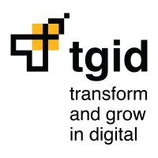
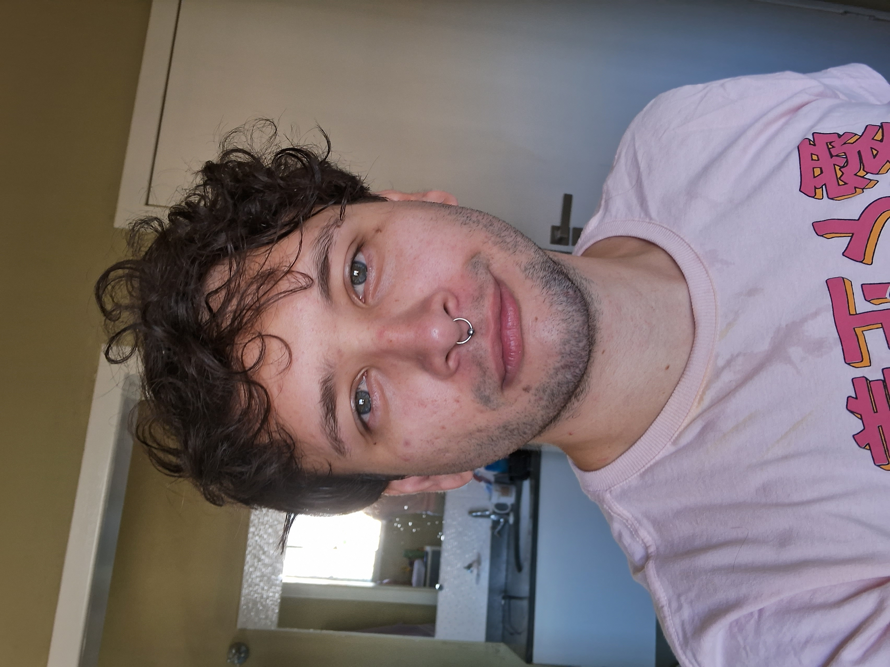

# Desafio Tgid

      

 
  
 
  
 
 
  
  
   
 

## Desafio

## Requisitos

## Solução

## Tecnologias Utilizadas

Front-End

* [JavaScript (ES6)](https://www.javascript.com)
* [HTML5](https://www.w3schools.com/css/)
* [CSS3](https://www.w3schools.com/css/)
* [Vue.js 2](https://vuejs.org/)

Back-End

* [Java](https://www.java.com/pt-BR/?msclkid=7faa842eb8f811ecab39772d4c1ae90b)

* [Spring boot](https://spring.io/projects/spring-boot)

Database

* [Oracle Autonomous Database](https://www.oracle.com/br/autonomous-database/)

Meetings and Communication

* [Discord](https://discord.com/?msclkid=b4f5af84b8f811ecbd81c127a0ae68a7)

* [Whatsapp](https://www.whatsapp.com/)

* [Slack](https://slack.com/intl/pt-br/?msclkid=c00e628eb8f811ecaef374bb86d7f056)

Other Tools

* [Github](https://github.com/)

* [Eclipse IDE](https://www.eclipse.org/downloads/)

* [IntelliJ IDE](https://www.jetbrains.com/idea/promo/?msclkid=6ae44e88c2811d86c0ae2cdbd94ffcfb&utm_source=bing&utm_medium=cpc&utm_campaign=AMER_en_BR_IDEA_Branded&utm_term=intellij&utm_content=intellij%20idea)

* [Jira](https://apifluffy.atlassian.net/jira/software/projects/EA/boards/1)

* [Photoshop](https://www.adobe.com/br/products/photoshop.html?sdid=KQPOM&mv=search&ef_id=d67181c6b224183a4875e395ae54f4bf:G:s&s_kwcid=AL!3085!10!79302406606568!79302288716688&msclkid=d67181c6b224183a4875e395ae54f4bf)

## DER

## Sobre o Desenvolvedor

|            							| Nome                 		| GitHub                                                      | LinkedIn                                              |
| -------------------------------------------- | ---------------- | -------------------------------------------------------------- | ----------------------------------------------------- |
|  |_Felipe Sobral_  | |  |

(<a href="#top">Voltar ao Topo</a>)

