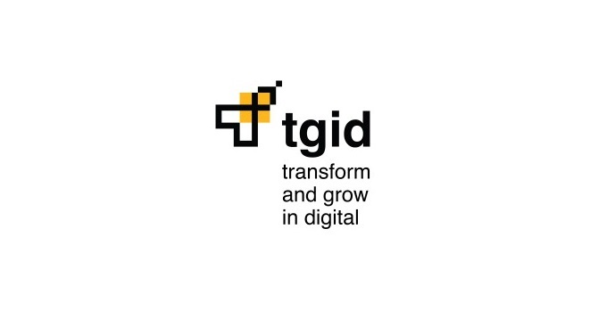
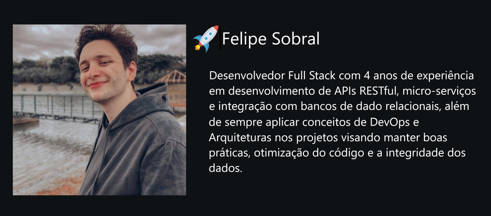
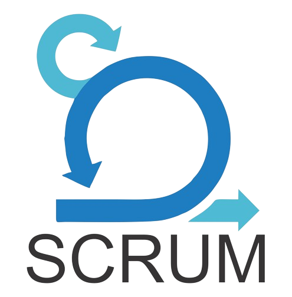
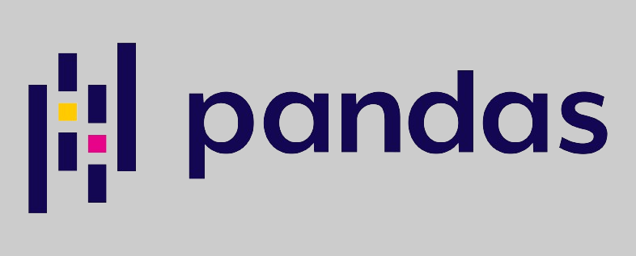

# Desafio Tgid

  

   
   
  
  

    
    
    
    
  

  

    
    
    
  

  
  

    
    
  

## Desafio
- Criação de um sistema utilizando ao menos dois usuários (Empresa e Cliente). Tanto o CPF quanto o CNPJ precisam serem validados. Para cada Empresa, deve haver ao menos um tipo de taxa de sistema que será 
incidida no momento da transação (seja saque ou depósito ). As Empresas devem ter um saldo que advém dos depósitos e saques realizados por Clientes na sua empresa, e já com o abate das taxas de administração. Clientes podem fazer depósitos e saques pelas Empresas (a depender dos saldos das empresas). No momento em que a transação é realizada, deve ser enviado um callback para Empresa informando a transação, e algum tipo de 
notificação para o Cliente (seja e-mail, SMS ou algo do tipo).
- Pontos principais: Lógica para regras de negócio, Modelagem de Dados, Clean Code, Manutenibilidade de código, Tratamento de Erros e Desacoplamento de componentes.

## Requisitos (Diferenciais)
- SpringBoot
- Documentação
- Propostas de Arquitetura
- Testes

## Solução

- Foi desenvolvida uma aplicação baseada em web que permite realizar transações (depósito ou saque), cadastrar novos clientes ou empresas, assim como ter acesso aos dados existentes no banco de dados. Muito além da criação da API no backend, foi também realizada uma interface simples e intuitiva que facilita o uso do usuário. Todas as exceções conhecidas foram tratadas e, com relação ao CPF e o CNPJ, foram criados algoritmos de autenticação, considerando não apenas o número de dígitos, mas também fazendo a verificação dos dígitos de controle, que são os dois últimos presentes tanto no CPF quanto no CNPJ.
- Além do tratamento de erros dentro do Spring Boot, foi configurado para o frontend Vue.js lidar com os erros retornados pelos controllers, realizando assim um evento que informa ao usuário a respeito da exceção ocorrida.
- Foram criados também métodos de envio de Callbacks para as empresas, assim como notificações por email aos clientes (usando o Spring Kafka), a respeito das transações que eles estão envolvidos e alterando então o saldo para o valor esperado. Esse saldo, no caso das empresas, é calculado considerando o valor da taxa para o tipo de transação definido anteriormente.
- Por fim, as funções vitais dos Controllers, Repositories e Services foram testados criando métodos de teste com a utilização de JUnit5 e Mockito.  

## Tecnologias Utilizadas

Front-End

* [JavaScript (ES6)](https://www.javascript.com)
* [TypeScript](https://www.typescriptlang.org/)
* [HTML5](https://www.w3schools.com/css/)
* [CSS3](https://www.w3schools.com/css/)
* [Vue.js](https://vuejs.org/)

Back-End

* [Spring boot](https://spring.io/projects/spring-boot)
* [Spring Data JPA](https://spring.io/projects/spring-data-jpa)
* [Hibernate](https://hibernate.org/)
* [Apache Kafka](https://spring.io/projects/spring-kafka)
* [Apache Maven](https://maven.apache.org/)

Banco de Dados e DevOps

* [PostgreSQL](https://www.postgresql.org/)
* [Docker](https://www.docker.com/)
* [Docker Compose](https://docs.docker.com/compose/)

Testes Unitários e de Integração

* [JUnit5](https://junit.org/junit5/)

* [Mockito](https://site.mockito.org/)

Outras ferramentas

* [Github](https://github.com/)

* [IntelliJ IDE](https://www.jetbrains.com/pt-br/idea/)

* [Visual Studio Code](https://code.visualstudio.com/)

## Estrutura do Banco (DER e Modelo Lógico)
- O projeto conta com três entidades, sendo que em uma delas, a entidade `Transacao`, possui duas chaves estrangeiras, portanto possui relacionamento com as demais. As outras duas entidades são `Cliente` e `Empresa`.

## Manual de Uso
- Caso tenha interesse em executar o projeto, o Manual de Uso ensina como instalar as dependências e como funciona cada uma das funcionalidades do projeto. [Acesse ele aqui]().

## Sumarização de Classes
- Caso tenha interesse em analisar para qual funcionalidade cada classe serve, assim como a motivação de cada um de seus atributos e métodos, seus retornos, [acesse a sumarização de classes por aqui]().

## Sumarização de Testes
- Caso tenha interesse em analisar os testes realizados e os resultados esperados, [acesse a sumarização de testes aqui]().

## Documentação Técnica
- Nessa seção, exploraremos alguns conceitos que foram implementados ao projeto e especificamente ao código, com o intuito de diminuir as chances de erros ocorrerem e para seguir as boas práticas convencionadas no desenvolvimento SpringBoot.

### 1. O uso de contâiners Docker e o Docker Compose

### 2. Tratamento de Erros/Exceções

### 3. Injeção de Dependências

### 4. Arquitetura em camadas (ou Arquitetura de três camadas)

### 5. Desacoplamento de componentes

### 6. Menssageria com Apache Kafka

### 7. Callback com

### 8. Testes Unitários e de Integração

### 9. Validação de CPF e CNPJ

## Sobre o desenvolvedor

  

 
 

<h3 align="center"> Acesse meu portfólio ou rede profissional:</h3>
              

  
                                                      
    
    
  

            

 
 

      

   <h3 align="center">Meu Set Skill:</h3>

   <table style="width: 100%; border-collapse: collapse;" align="center">
          <thead>
              <tr>
                  <th></th>
                  <th>Tecnologia</th>
                  <th>Experiência</th>
                  <th>Tempo de Uso</th>
              </tr>
          </thead>
          <tbody>
              <tr>
                  <td align="center"></td>
                  <td><em>Java</em></td>
                  <td>Avançado</td>
                  <td>5 anos</td>
              </tr>
              <tr>
                  <td align="center"></td>
                  <td><em>SpringBoot</em></td>
                  <td>Avançado</td>
                  <td>4 anos</td>
              </tr>
              <tr>
                    <td align="center">
                      

                        
                        

                    </td>
                    <td><em>JPA e Hibernate</em></td>
                    <td>Avançado</td>
                    <td>4 anos</td>
              </tr>
              <tr>
                    <td align="center"></td>
                    <td><em>SpringBoot Security</em></td>
                    <td>Avançado</td>
                    <td>4 anos</td>
              </tr>
              <tr>
                    <td align="center">
                      

                        
                        
                        
                    </td>
                    <td><em>SQL e PL/SQL</em></td>
                    <td>Avançado</td>
                    <td>5 anos</td>
              </tr>
              <tr>
                    <td align="center"></td>
                    <td><em>JUnit5</em></td>
                    <td>Intermediário</td>
                    <td>1 ano</td>
              </tr>
              <tr>
                    <td align="center"></td>
                    <td><em>Mockito</em></td>
                    <td>Intermediário</td>
                    <td>1 ano</td>
              </tr>
              <tr>
                    <td align="center">
                      

                        
                        
                      
  
                    </td> 
                    <td><em>Git e Github</em></td>
                    <td>Avançado</td>
                    <td>5 anos</td>
              </tr>
              <tr>
                    <td align="center"></td>
                    <td><em>Metodologia Ágil Scrum</em></td>
                    <td>Avançado</td>
                    <td>4 anos</td>
              </tr>  
              <tr>
                    <td align="center"></td>
                    <td><em>Docker</em></td>
                    <td>Intermediário</td>
                    <td>1 ano</td>
              </tr>  
              <tr>
                    <td align="center"></td>
                    <td><em>Docker Compose</em></td>
                    <td>Intermediário</td>
                    <td>1 ano</td>
              </tr>  
              <tr>
                    <td align="center"></td>
                    <td><em>Apache Kafka</em></td>
                    <td>Intermediário</td>
                    <td>1 ano</td>
              </tr>  
              <tr>
                    <td align="center"></td>
                    <td><em>JavaScript</em></td>
                    <td>Avançado</td>
                    <td>3 anos</td>
              </tr>  
              <tr>
                    <td align="center"></td>
                    <td><em>TypeScript</em></td>
                    <td>Avançado</td>
                    <td>2 anos</td>
              </tr>
              <tr>
                    <td align="center"></td>
                    <td><em>Vue.js</em></td>
                    <td>Avançado</td>
                    <td>3 anos</td>
              </tr>
              <tr>
                    <td align="center"></td>
                    <td><em>React.js</em></td>
                    <td>Intermediário</td>
                    <td>1 ano</td>
              </tr>
              <tr>
                    <td align="center"></td>
                    <td><em>CSS3</em></td>
                    <td>Avançado</td>
                    <td>5 anos</td>
              </tr>
              <tr>
                    <td align="center"></td>
                    <td><em>HTML5</em></td>
                    <td>Avançado</td>
                    <td>5 anos</td>
              </tr>  
              <tr>
                    <td align="center"></td>
                    <td><em>JavaFx</em></td>
                    <td>Intermediário</td>
                    <td>2 anos</td>
              </tr>  
              <tr>
                    <td align="center"></td>
                    <td><em><b>Python</b></em></td>
                    <td>Avançado</td>
                    <td>5 anos</td>
              </tr>  
              <tr>
                    <td align="center"></td>
                    <td><em>Flask</em></td>
                    <td>Avançado</td>
                    <td>4 anos</td>
              </tr>  
              <tr>
                    <td align="center"></td>
                    <td><em>Pandas</em></td>
                    <td>Avançado</td>
                    <td>3 anos</td>
              </tr>  
              <tr>
                    <td align="center"></td>
                    <td><em>SQLAlchemy</em></td>
                    <td>Avançado</td>
                    <td>4 anos</td>
              </tr>   
              <tr>
                    <td align="center"></td>
                    <td><em>Selenium</em></td>
                    <td>Intermediário</td>
                    <td>3 anos</td>
              </tr>   
          </tbody>
      </table>

              

(<a href="#top">Voltar ao Topo</a>)

