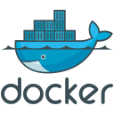

# Desafio tgid
<div style="display: flex; flex-direction: column; justify-content: center; align-items: center;">

  

  <br>
  <br>
  
  
  <p align="center">
    <a href="https://www.java.com/pt-BR/"></a>
    <a href="https://www.java.com/pt-BR/"></a>
    <a href="https://www.java.com/pt-BR/"></a>
    <a href="https://www.javascript.com/"></a>
  </p>

  <p align="center">
    <a href="https://embraer.com/br/pt"></a>
    <a href="https://www.javascript.com/"></a>
    <a href="https://www.javascript.com/"></a>
  </p>
  
  <p align="center">
    <a href="http://fatecsjc-prd.azurewebsites.net/"></a>
    <a href="https://www.javascript.com/"></a>
    <a href="https://www.javascript.com/"></a>
  </p>
</div>

## <p align="center"> Índice </p>

<div align="center">

| Tópico                   |
|--------------------------|
| [Desafio](#desafio)                     |
| [Requisitos (Diferenciais)](#requisitos-diferenciais) |
| [Solução](#solução)                     |
| [Tecnologias Utilizadas](#tecnologias-utilizadas)   |
| [Estrutura do Banco](#estrutura-do-banco)        |
| [Manual de Uso](#manual-de-uso)               |
| [Sumarização de Classes](#sumarização-de-classes)   |
| [Documentação Técnica](#documentação-técnica)      |
| [Sobre o desenvolvedor](#sobre-o-desenvolvedor)    |

</div>

## Desafio
Criação de um sistema utilizando ao menos dois usuários (Empresa e Cliente). Tanto o CPF quanto o CNPJ precisam serem validados. Para cada Empresa, deve haver ao menos um tipo de taxa de sistema que será 
incidida no momento da transação (seja saque ou depósito ). As Empresas devem ter um saldo que advém dos depósitos e saques realizados por Clientes na sua empresa, e já com o abate das taxas de administração. Clientes podem fazer depósitos e saques pelas Empresas (a depender dos saldos das empresas). No momento em que a transação é realizada, deve ser enviado um callback para Empresa informando a transação, e algum tipo de 
notificação para o Cliente (seja e-mail, SMS ou algo do tipo).


• <b>Pontos principais:</b> Lógica para regras de negócio, Modelagem de Dados, Clean Code, Manutenibilidade de código, Tratamento de Erros e Desacoplamento de componentes.

## Requisitos (Diferenciais)
- SpringBoot
- Documentação
- Propostas de Arquitetura
- Testes

## Solução


- Foi desenvolvida uma aplicação baseada em web que permite realizar transações (depósito ou saque), cadastrar novos clientes ou empresas, assim como ter acesso aos dados existentes no banco de dados. Muito além da criação da API no backend, foi também realizada uma interface simples e intuitiva que facilita o uso do usuário. Todas as exceções previstas nos testes realizados foram tratadas para fornecer ao usuário uma resposta agradável e, com relação ao CPF e o CNPJ, foram criados algoritmos de validação, considerando não apenas o número de dígitos, mas também fazendo a verificação dos dígitos de controle, que são os dois últimos presentes tanto no CPF quanto no CNPJ.
- Além do tratamento de erros dentro do Spring Boot, foi configurado para o frontend Vue.js lidar com os erros retornados através de uma requisição, realizando assim um evento que informa ao usuário a respeito da exceção ocorrida de forma que o erro possa ser compreendido sem conhecimento técnico da lógica de negócio da aplicação e das exceções próprias do Java ao realizar uma operação não permitida por sua sintaxe ou por suas regras de tipagem.
- Foram criados também, utilizando a plataforma de streaming do Apache Kafka, métodos de envio de Callbacks para as empresas, assim como notificações por email aos clientes, a respeito das transações que eles estão envolvidos e alterando então o saldo para o valor esperado. Esse saldo, no caso das empresas, é calculado considerando o valor da taxa para o tipo de transação definido anteriormente. A notificação é enviada aos clientes e empresas tanto em casos de sucesso, quanto em casos onde a transação não pode ser concluída em uma circunstância onde uma das entidades não possui saldo suficiente para realizá-las.
- Por fim, as funções vitais dos Controllers, Repositories e Services foram testados através de Mocks criando métodos de teste unitário com a utilização de JUnit5 e Mockito. Foram feitos também testes de integração para testar a integridade da resposta da API Rest diante de todos os cenários possíveis dentro de uma requisição a um determinado endpoint.  

## Tecnologias Utilizadas
<details>
<summary>Front-End</summary>

* [JavaScript (ES6)](https://www.javascript.com)
* [TypeScript](https://www.typescriptlang.org/)
* [HTML5](https://www.w3schools.com/css/)
* [CSS3](https://www.w3schools.com/css/)
* [Vue.js](https://vuejs.org/)


</details>

<details>
<summary>Back-End</summary>

* [Spring boot](https://spring.io/projects/spring-boot)
* [Spring Data JPA](https://spring.io/projects/spring-data-jpa)
* [Hibernate](https://hibernate.org/)
* [Apache Kafka](https://spring.io/projects/spring-kafka)
* [Apache Maven](https://maven.apache.org/)

</details>

<details>
<summary>Banco de Dados e DevOps</summary>

* [PostgreSQL](https://www.postgresql.org/)
* [Docker](https://www.docker.com/)
* [Docker Compose](https://docs.docker.com/compose/)

</details>
<details>
<summary>Testes Unitários e de Integração</summary>

* [JUnit5](https://junit.org/junit5/)

* [Mockito](https://site.mockito.org/)

* [Spring Test (MockMvc)](https://docs.spring.io/spring-framework/reference/testing/spring-mvc-test-framework.html)

</details>

<details>
<summary>Outras ferramentas</summary>

* [Git](https://git-scm.com/)

* [Github](https://github.com/)

* [IntelliJ IDE](https://www.jetbrains.com/pt-br/idea/)

* [Visual Studio Code](https://code.visualstudio.com/)

</details>

## Estrutura do Banco
O projeto conta com três entidades: `Cliente`, `Empresa` e `Transacao`. A entidade `Transacao`, que representa os registros de depósitos e saques realizados entre clientes e empresas, possui duas chaves estrangeiras, portanto possui relacionamento com as demais entidades.


## Manual de Uso
Caso tenha interesse em executar o projeto, o Manual de Uso ensina como instalar as dependências, como executar o projeto, e como funciona cada uma das funcionalidades. [Acesse ele aqui](https://github.com/SoSoJigsaw/Desafio_TGID/blob/main/documentacao/Manual%20de%20Uso.md).

## Sumarização de Classes
Caso tenha interesse em analisar para qual funcionalidade cada classe do projeto serve, assim como a motivação de cada um de seus atributos, métodos e seus retornos, [acesse a sumarização de classes por aqui](https://github.com/SoSoJigsaw/Desafio_TGID/blob/main/documentacao/Sumarios%20Das%20Classes/Controllers.md).

## Documentação Técnica
Nessa seção, será explorado alguns conceitos que foram implementados ao projeto e especificamente ao código, com o intuito de diminuir as chances de erros ocorrerem, seguir as boas práticas convencionadas no desenvolvimento SpringBoot, e para prover manutenbilidade ao código.

### <p align="center"> Índice da Documentação Técnica </p>

<div align="center">

| Tópico                                                   |
|----------------------------------------------------------|
| [1. Implementação da Lógica de Negócios](#1-implementação-da-lógica-de-negócios)            |
| [2. O uso de contêineres Docker e o Docker Compose](#2-o-uso-de-contêineres-docker-e-o-docker-compose) |
| [3. Tratamento de Erros/Exceções](#3-tratamento-de-erros-exceções)                         |
| [4. Injeção de Dependências](#4-injeção-de-dependências)                               |
| [5. Arquitetura em camadas (ou Arquitetura de três camadas)](#5-arquitetura-em-camadas-ou-arquitetura-de-três-camadas)   |
| [6. Desacoplamento de componentes](#6-desacoplamento-de-componentes)                     |
| [7. Mensageria com Apache Kafka](#7-mensageria-com-apache-kafka)                         |
| [8. Testes Unitários e de Integração](#8-testes-unitários-e-de-integração)               |
| [9. Validação de CPF e CNPJ](#9-validação-de-cpf-e-cnpj)                     

</div>


### 1. Implementação da Lógica de Negócios
Seguindo as boas práticas no ambiente de desenvolvimento Spring Boot, e a arquitetura adotada (arquitetura em camadas), a lógica principal de negócios da aplicação se desenvolveu dentro das classes que se encontram no package `service`. Todas as classes que possuem anotação `@Service` estão incluídas e são essenciais para a lógica de uma das funcionalidades da API. Ou seja, são nos services que a lógica de negócios se desenvolveu. Para a lógica principal de negócio, que é aquela que envolve a manipulação das entidades, foi criado um service para cada uma dessas entidades (Cliente, Empresa, Transacao).


Dentro dos services das entidades, foram desenvolvidos métodos relacionados a rotinas do banco de dados (no caso, rotinas do Spring Data JPA) e que são métodos CRUD. Portanto, os métodos incluem lógicas para:
- Criação de objetos de uma determinada Entity
- Geração de listas com todos os objetos de uma determinada Entity 
- Exclusão de um objeto de uma determinada Entity
- Modificação do valor de atributos de um objeto de uma determinada Entity


Além destes métodos previsíveis e com estrutura habitual, alguns métodos da classe `TransacaoServiceImpl` demonstram um nível maior de complexidade lógica, já que dentro destes ocorre não somente mudanças na entidade Transacao, mas sim em todas as três entidades. Isso ocorre pelo fato da entidade Transacao possuir duas chaves estrangeiras que o conectam às entidades Cliente e Empresa. Ademais, os métodos `realizarDeposito` e `realizarSaque` realizam diversas operações com dependências externas, além de serem os métodos acionadores das notificações para empresas e clientes.   


Outros services existentes servem para atender a lógicas que não manipulam as entidades, é o caso das classes dentro do package `Notification`, que servem para implementar a lógica de formatação das notificações para empresas e clientes, e também para acionar o Produtor Kafka para enviar o tópico. As classes de produtor e consumidor do Apache Kafka, inseridos no package `Kafka`, são também services e encapsulam a lógica de produzir mensagems a tópicos e ouvir essas mensagens, com o intuito de enviar por fim as notificações formatadas pelos services do package `Notification`.


Outras classes que utilizam a anotação spring genérica de `@Component` implementam operações que são auxiliares à lógica de negócios dos services. É o caso da classe `CalcularTaxaImpl` do package `Util`, que tem os seus métodos sendo chamados pelos services apenas para calcular a taxa que será paga pela empresa mediante o valor da transação de depósito ou saque, e a alíquota incidente nessa operação estabelecida para aquela empresa. O outro caso são as classes de validação do CPF, CNPJ e Taxa pertencentes ao package `Validation`, que possuem algoritmos de validação e que tem os seus métodos sendo chamados pelos services para realizar própriamente a validação desses atributos.


Por fim, é importante dizer que os métodos dos services procuram tratar os erros previsíveis durante a execução da lógica de negócios ou ao interagir com os componentes de persistência de dados, através de `try/catch` e lançando uma exceção personalizada que atenda a um erro que contradiz à lógica estabelecida, como seria o caso da tentativa de realizar um depósito com um valor negativo, nulo ou zero.

### 2. O uso de contêineres Docker e o Docker Compose
Docker é uma plataforma que permite automatizar o processo de implantação de aplicativos em contêineres, oferecendo uma abordagem para "empacotar" um aplicativo com todas as suas dependências em um contêiner virtual. Já o Docker Compose é uma ferramenta que facilita a definição e execução de aplicativos Docker compostos por vários contêineres (ou seja, serve como um orquestrador). 


Para esse projeto, optei por implementar todos os serviços envolvidos em contêineres:
- Banco de Dados PostgreSQL
- Apache ZooKeeper (Um serviço que é uma dependência para o funcionamento do Kafka em um ambiente distribuído)
- Apache Kafka
- SpringBoot
- Vue.js


Há diversas vantagens em se utilizar o Docker. Vejo a utilização de contêineres como uma boa prática de desenvolvimento, já que eles são capazes de <b>isolar as dependências</b>, garantindo que o ambiente de execução seja consistente em diferentes máquinas e ambientes, e também por sua <b>portabilidade</b>, que permite que o contêiner seja executado em qualquer lugar que suporte Docker, independentemente do sistema operacional ou da infraestrutura subjacente. Pensando na possibilidade de alguém quiser executar o projeto, sem o uso do Docker haveria um problema, pois sendo o banco de dados local, seria impossível a execução do Spring Boot, assim como seria necessário executar um servidor Kafka com as mesmas configurações de tópico, grupo e portas do projeto para que o Produtor, Consumidor e o Listener configurados no projeto pudessem realizar suas ações. Além disso, em relação ao SpringBoot e ao Vue.js, configurá-los em contêiners evita inconsistências de ambiente gerados, por exemplo, por diferentes versões da JDK, Node, e outras dependências, entre diferentes máquinas de desenvolvimento ou ambientes de execução. 


Já a utilização do Docker Compose veio da necessidade de uma orquestração simples dos cinco contêineres que estão sendo utilizados no projeto e que possuem uma relação de dependência entre eles. Outra necessidade que havia e com o Docker Compose pude resolver, é o de garantir que um determinado serviço seja iniciado antes de outro, ou seja, o Docker Compose garante que os serviços sejam iniciados na ordem correta e que tenham acesso uns aos outros conforme necessário. Esse era um problema que eu enfrentava com relação o Apache Kafka, já que o serviço necessita de que o ZooKeeper esteja sendo executado antes dele, caso contrário, o Kafka apresentará diversos erros. Assim como, para iniciar o Spring Boot, é necessário que o contêiner do PostgreSQL, ZooKeeper e Kafka estejam em execução.

### 3. Tratamento de Erros/Exceções
Ao invés de utilizar exceções nativas do Spring e das bibliotecas que formam as dependências do projeto, foram criadas classes que estendem a classe `RuntimeException` para se ter exceções personalizadas que atendiam a erros possíveis detectados nos testes e que poderíam serem lançados entre os métodos e operações das classes. Essas exceções personalizadas correspondem às operações que ocorrem nos Controllers e Services, atendendo à lógica de negócio do projeto. 


A utilização do tratamento de erros visava dar à aplicação mais robustez, garantindo que ela possa lidar com situações que fogem da lógica do negócio e das regras do próprio Java e de suas dependências sem falhar abruptamente. Através das exceções personalizadas, a mensagem fornecida consegue se tornar mais significativa ao usuário, pois consegue descrever de forma simples qual é o erro que ocorreu, além de tornar mais fácil o entendimento do erro pelo desenvolvedor para diagnosticar os problemas quando eles ocorrerem. Ou seja, as exceções personalizadas facilitam o rastreamento e a depuração de erros, pois fornecem informações sobre a natureza específica do problema. Além disso, as exceções personalizadas tornam o código mais legível e claro, indicando explicitamente as condições excepcionais que podem ocorrer.


Basicamente, todos os erros que poderíam serem gerados dentro da aplicação a partir de seus métodos que estão relacionados à lógica do negócio, foram devidamente tratados, criando-se classes de exceção a elas e incluindo as mesmas nos métodos do Controller e Service, seja com condições lógicas como o `if` ou então através do `try/catch`.


A criação dessas exceções personalizadas permitiu também evitar requisições que ferissem a lógica de negócio da aplicação e que, por não ferirem as regras do Java ou do Spring, acabassem por não falharem e assim gerar resultados que não deveriam ocorrer. Seria o caso, por exemplo, do cadastramento de um CPF que fosse inválido: para o Java, essa ocasião não resultaria em uma exceção e, portanto, foi necessário criar exceções personalizadas que atendessem a essa e a outras violações da lógica de negócio implementada.


No caso de requisições que acabam por lançar exceções por conta da própria regra de sintaxe ou tipagem do Java, para gerar ao usuário uma resposta não técnica e fácil de compreender, foi criado também exceções personalizadas que lidam com esses casos. Um exemplo disso seria o caso, por exemplo, de o usuário tentar realizar um saque com o valor da transação nula: isso ocasionaria uma exceção `NullPointerException`, já que o valor da transação é do tipo `double`, e esse tipo não pode receber valores nulos. Sendo assim, ao ser lançado essa exceção, ao invés da mensagem padrão do Java, a mensagem retornada é simples para o entendimento do usuário: "Erro no processamento da transação de saque: Parâmetros numéricos não podem serem nulos. Tente novamente".


Além de essas exceções retornarem uma mensagem no console do Springboot, sendo útil ao desenvolvedor, as exceções retornam também uma mensagem a nível do usuário. Para esses casos, se tratando a aplicação de uma API REST onde o usuário fará requisições aos endpoints, os erros foram tratados de forma a enviar uma resposta `ResponseEntity<?>` com o HTTP Status adequado ao erro, como `400 BAD_REQUEST` ou `404 NOT_FOUND`, junto a um body que é um JSON que contém as propriedades `status`, que tem como valor o HTTP STATUS correspondente, e `mensagem`, onde há a descrição do erro que ocorreu em uma linguagem simples, não técnica, e que possibilita contextualizar de forma clara em que operação o erro ocorreu e como poder solucioná-lo. Esse tipo de tratamento de erro, retornando ao lançar a exceção uma `ResponseEntity<?>`, é útil pelo fato da aplicação se tratar de uma API REST, e o usuário não tem conhecimento da lógica de negócio. Como neste projeto foi desenvolvido uma interface web para o usuário interagir, esse tratamento personalizado possibilita que o frontend (Vue.js) possa lidar com a resposta em casos de erro, e fornecer ao usuário um aviso que o deixa ciente que a requisição falhou. Um exemplo disso é quando há uma exceção lançada por um CPF inválido: neste caso, o tratamento do erro é feito enviando uma `ResponseEntity<?>` com body "O cliente não pôde ser registrado: CPF Inválido". Assim que o Vue.js reconhece essa resposta, ele cria alertas que avisam ao usuário do frontend a respeito do erro ocorrido e, ao mesmo tempo, o erro também é descrito no console do Spring.

```json
{
  "status": "BAD_REQUEST",
  "mensagem": "O cliente não pôde ser registrado: O CPF 466.625.052-26 já foi utilizado por outro cliente. Tente Novamente"
}
```

Por fim, é importante citar que esse comportamento das exceções personalizadas de retornarem respostas HTTP JSON, foi configurado na classe `RestExceptionHandler` do package `infra` que possui a anotação `@RestControllerAdvice`. Essa anotação permite centralizar o tratamento de exceções para os Controllers REST. Ou seja, quando uma exceção é lançada durante a execução de um dos controllers da aplicação, sendo todos eles anotados como `@RestController`, o Spring Boot automaticamente busca métodos anotados com `@ExceptionHandler` que estão dentro da classe marcada com a anotação `@RestControllerAdvice` para tratar a exceção específica. Dessa forma, para todas as exceções personalizadas criadas, foi criado na classe `RestExceptionHandler` um método handler para manipulá-lo globalmente a retornar respostas JSON.

```java
@ExceptionHandler(ClienteNaoEncontradoException.class)
    private ResponseEntity<?> ClienteNaoEncontradoExceptionHandler(ClienteNaoEncontradoException e) {

        ErroDTO erro = new ErroDTO(HttpStatus.NOT_FOUND, e.getMessage());

        return ResponseEntity.status(HttpStatus.NOT_FOUND).body(erro);
    }
```

### 4. Injeção de Dependências
Injeção de dependências é um padrão de design utilizado no paradigma orientado a objetos, onde as dependências de um objeto são fornecidas a ele por meio de construtores, métodos de configuração ou de forma direta, em vez de o próprio objeto criar essas dependências. A importância da injeção de dependências no Spring Boot reside no fato de que ela promove um código mais limpo, modular e de fácil manutenção.


O Spring Boot utiliza principalmente dois tipos de injeção de dependências: a injeção de dependências por construtor e a injeção de dependências por meio de anotações, como `@Autowired`


Como boa prática de desenvolvimento em Spring Boot, foi utilizado a <b>injeção de dependências por construtor</b>, já que traz maior clareza e transparência, pelo fato de todas as dependências serem explicitamente declaradas no construtor da classe, facilitando a compreensão do código e a identificação das dependências necessárias. Além disso, sua característica de imutabilidade é considerada uma prática recomendada. Por exemplo, os controllers geralmente têm uma ou algumas dependências que são essenciais para o seu funcionamento, como serviços para lidar com a lógica de negócios e acesso a dados. A injeção por construtor facilita a passagem dessas dependências de forma clara e explícita, tornando o código mais fácil de entender, testar e manter.

```java
    private final TransacaoRepository transacaoRepository;
    private final EmpresaRepository empresaRepository;
    private final ClienteRepository clienteRepository;
    private final CalcularTaxa calcularTaxa;
    private final NotificacaoEmpresa notificacaoEmpresa;
    private final NotificacaoCliente notificacaoCliente;
    
    public TransacaoServiceImpl(TransacaoRepository transacaoRepository, EmpresaRepository empresaRepository,
                                ClienteRepository clienteRepository, CalcularTaxa calcularTaxa,
                                NotificacaoEmpresa notificacaoEmpresa, NotificacaoCliente notificacaoCliente) {
        this.transacaoRepository = transacaoRepository;
        this.empresaRepository = empresaRepository;
        this.clienteRepository = clienteRepository;
        this.calcularTaxa = calcularTaxa;
        this.notificacaoEmpresa = notificacaoEmpresa;
        this.notificacaoCliente = notificacaoCliente;
    }
```

As classes de teste utilizaram a <b>injeção de dependências por anotação</b>, principalmente as anotações `@Mock` e `@InjectMocks`. já que facilita a criação de instâncias da classe de teste com dependências mockadas ou simuladas. É extremamente útil em testes unitários, onde se deseja isolar a unidade de código sendo testada e fornecer mocks para suas dependências. 

```java
    @Mock
    private TransacaoRepository transacaoRepository;

    @Mock
    private EmpresaRepository empresaRepository;

    @Mock
    private ClienteRepository clienteRepository;

    @Mock
    private ClienteService clienteService;

    @Mock
    private EmpresaService empresaService;

    @Mock
    CalcularTaxa calcularTaxa;

    @Mock
    NotificacaoEmpresa notificacaoEmpresa;

    @Mock
    NotificacaoCliente notificacaoCliente;

    @InjectMocks
    TransacaoServiceImpl transacaoService;
```

### 5. Arquitetura em camadas (ou Arquitetura de três camadas)
Quando se trata de desenvolver um software, a arquitetura é fundamental para garantir que o sistema seja bem organizado, escalável, e de fácil manutenção. Por isso, optei para esse projeto a `Arquitetura em Camadas`, que é um padrão arquitetural similar ao MVC, mas que é considerada uma implementação mais moderna e flexível, pois permite uma maior separação de responsabilidades e uma melhor modularidade do código.


Essa arquitetura organiza o sistema em camadas distintas, cada uma responsável por uma função específica. Essa abordagem promove a separação de responsabilidades e facilita a manutenção, escalabilidade e testabilidade do código. Um exemplo de como essa arquitetura divide o sistema em camadas distintas, é o fato de que Controllers, Services e Repositories possuem atribuições diferentes.


Quanto a sua característica de modularidade do código, cada camada pode ser desenvolvida, testada e mantida de forma independente. Isso facilita a reutilização de código e permite que diferentes partes do sistema sejam modificadas sem afetar o restante do código. O Controller, Service e Repository são componentes independentes que podem ser desenvolvidos separadamente e substituídos conforme necessário, sem afetar as outras partes do sistema. 

#### Controllers
- Os controllers são responsáveis por receber as requisições HTTP, chamar os métodos dos services apropriados e retornar as respostas adequadas. Essa camada lida com a interação entre o cliente (usuário) e a lógica de negócios (Service).
#### Services
- Contêm a lógica de negócios da aplicação. São responsáveis por realizar operações mais complexas, coordenando a interação entre os repositories e executando ações específicas do domínio da aplicação. Ou seja, o service encapsula a lógica de negócios e manipula os dados.
#### Repositories
- São responsáveis por acessar e manipular os dados no banco de dados. Eles fornecem métodos para realizar operações de leitura e gravação no banco de dados de forma transparente para as outras camadas da aplicação. Ou seja, o repository lida com a persistência e recuperação de dados.	

### 6. Desacoplamento de componentes
O desacoplamento de componentes é um princípio de design em engenharia de software que preconiza a redução das dependências entre diferentes partes de um sistema. Em outras palavras, componentes desacoplados são aqueles que têm o mínimo possível de conhecimento sobre a implementação interna um do outro, o que os torna mais independentes e flexíveis. O desacoplamento promove a modularidade, facilita a manutenção, testabilidade e escalabilidade do código.


Como práticas de desacoplamento no projeto, foram utilizados:
- <b>Injeção de Dependências:</b> com a injeção de dependência, as dependências de um componente são injetadas por um contêiner de IoC, em vez de serem instanciadas pelo próprio componente. Isso reduz as dependências diretas entre os componentes. Como método principal, foi utilizado a injeção de dependências por construtor.
- <b>Interfaces:</b> definir interfaces para os componentes permite que diferentes implementações sejam trocadas sem afetar os clientes dessas interfaces, promovendo assim um alto grau de desacoplamento. Dentro do projeto, foram criadas interfaces para todas as classes com a anotação `@Service`, sendo uma boa prática conhecida em desenvolvimento Spring, e em algumas classes genéricas com anotação `@Component` que já não eram uma implementação de outra interface, como é o caso, por exemplo, da classe de validação de CPF, que é uma implementação da interface `ConstraintValidator`, que faz parte do Jakarta (anteriormente conhecido como Java EE). Para classes de configuração, Controllers e Entities não foram criadas interfaces, já que não são diretamente instanciados ou usados como dependências em outras partes do código. Quanto aos Repositories, eles já são interfaces que estendem o `JpaRepository`, e como não houve a necessidade de personalizar ou estender os métodos fornecidos pelo JPA, não seria útil ou boa prática criar uma nova interface nessa circunstância.
- <b>Uso de DTOs (Data Transfer Objects):</b> o uso de DTOs para transferência de dados ajuda a reduzir o acoplamento entre as entidades. No projeto, alguns DTOs foram criados com o intuito de formular a response de requisições em um formato que se aproxima do JSON, assim como para receber dados JSON de requests e poder manipulá-los no Spring Boot. Os métodos dos Controllers e Services, ao invés de lidarem diretamente com as suas respectivas entidades, utilizam de DTOs.
- <b>Eventos e Listeners:</b> são componentes que reagem a eventos sem terem conhecimento direto uns dos outros. Isso é útil para desacoplar a lógica de negócios. O Apache Kafka, que está sendo utilizado na aplicação, pode ser considerado como uma forma de implementar a comunicação assíncrona entre componentes do sistema. Simplesmente, um produtor publica mensagens em um tópico do Kafka e um consumidor escuta esse tópico usando a anotação `@KafkaListener`. Quando o consumidor detecta uma nova mensagem no tópico, ele executa um método específico para processar essa mensagem, sem ter conhecimento direto do produtor.

### 7. Mensageria com Apache Kafka


O Apache Kafka é uma plataforma de streaming distribuída que permite a publicação e subscrição de fluxos de dados em tempo real. Ele permite que os serviços comuniquem-se de forma assíncrona, o que pode melhorar a escalabilidade e a resiliência da aplicação. O Kafka pode ser usado para processar grandes volumes de dados em tempo real, permitindo que as aplicações do Spring Boot processem e reajam a eventos em tempo real.

Apesar de não ser um projeto de microsserviços, decidi adotar o Apache Kafka visando um deploy futuro que tenha um nível maior de complexidade, já que o Kafka traz uma solução flexível e expansível. Isso significa que, se no futuro a aplicação migrar para uma arquitetura baseada em microserviços, já terá a infraestrutura necessária em vigor. Minha decisão pelo Apache Kafka foi também por suas várias vantagens: 
- Ao utilizar o Kafka, você pode executar operações de forma assíncrona. Isso significa que, quando um tópico é ouvido pelo KafkaListener, o método anotado com `@KafkaListener` pode ser executado de forma independente do restante da lógica do aplicativo. Isso pode melhorar o desempenho geral do aplicativo, permitindo que outras operações continuem enquanto o método do KafkaListener é executado.
- Kafka foi projetado para ser altamente escalável, mesmo em um ambiente não distribuído. Isso significa que, à medida que o volume de mensagens aumenta, o Kafka pode lidar com essa carga adicional de forma eficiente, garantindo que o aplicativo Spring Boot possa crescer sem comprometer o desempenho.
- Kafka oferece recursos de persistência de mensagens, garantindo que as mensagens não sejam perdidas mesmo em caso de falha do consumidor. Isso significa que, mesmo que o consumidor do Kafka não esteja disponível por algum motivo, as mensagens ainda serão processadas assim que o consumidor estiver de volta online.
- Kafka é ideal para lidar com fluxos de dados em tempo real. Mesmo em um aplicativo que não é baseado em microserviços, pode-se aproveitar essa capacidade do Kafka para processar eventos em tempo real, como a criação e envio de e-mails, que é especificamente a finalidade de uso para essa aplicação.

#### Envio de emails aos Clientes
Para enviar emails aos clientes envolvidos em transações, foi utilizado componentes do `Spring Mail` e também a biblioteca padrão do Java para enviar e receber emails, que é o `JavaMail`. Para criar um objeto de email no formato necessário, utilizou-se a classe `MimeMessage`, e foi usado a interface `JavaEmailSender` para o envio do email através da API do `JavaMail`. Antes do envio, como essa funcionalidade é baseada na utilização de um servidor Apache Kafka, foi necessário converter um objeto do tipo `EmailDTO` em String, enviar então essa String através do `KafkaTemplate` para o servidor Kafka no tópico `transacao.request.topic`. A mensagem enviada pelo Produtor é basicamente uma String contendo todos os dados necessários para a criação de um email (destinatário, assunto, corpo). Logo em seguida, de forma assíncrona, a mensagem produzida pelo Produtor `KakfaProducer` é ouvida pelo Consumidor `KafkaConsumer` através do método `processarMensagemTransacaoCliente` com anotação `@KafkaListener`, e então o método do Listener é executado, sem a necessidade de executar a chamada do método de maneira manual ou em declaração no código. Com a execução do método Listener do Consumidor, a String passada pelo Produtor é novamente configurada como um objeto `EmailDTO`, para que depois os atributos desse objeto sejam os argumentos do objeto email que será criado. Então, é feita a chamada do método `enviarEmailAoUsuario`, onde os atributos do objeto `EmailDTO` são passados como parâmetro. O método usa a classe `MimeMessageHelper` para auxiliar a criação e configuração do objeto `MimeMessage`, recebendo os parâmetros de destinatário, assunto e corpo da mensagem, para então criar o email. Por fim, a interface `JavaMailSender` é chamada para realizar o envio.

Como servidor SMTP (Simple Mail Transfer Protocol), foi utilizado o serviço da [Ethereal Email](https://ethereal.email/). Como a grande maioria dos servidores SMTP são pagos, o Ethereal foi a opção mais viável, já que ele existe justamente para que desenvolvedores simulem e testem o envio de emails em suas aplicações, sem enviar mensagens para endereços de email reais. 


#### Callback para as Empresas
No contexto de uma chamada assíncrona, o callback é executado quando a resposta da chamada é recebida. Para realizar o callback para a Empresa, foi utilizado o `RestTemplate`, com o qual um callback pode ser enviado como parte de uma chamada assíncrona a um serviço externo, que no caso foi usado o serviço online da [Webhook](https://webhook.site) de geração de endpoints temporários, usando-o para simular um callback para uma empresa que esteja envolvida em uma determinada transação.

Essa funcionalidade também faz uso de um servidor Apache Kafka. Foi necessário converter um objeto do tipo CallbackDTO em String, enviar então essa String através do KafkaTemplate para o servidor Kafka no tópico `callback.request.topic`. A mensagem enviada pelo Produtor é basicamente uma String contendo a `url` do serviço externo que receberá o callback, e a `mensagem` que é o JSON enviado na resposta que contém informações a respeito da transação realizada. Logo em seguida, de forma assíncrona, a mensagem produzida pelo Produtor (`KakfaProducer`) é ouvida pelo Consumidor (`KafkaConsumer`) através do método `processarMensagemTransacaoEmpresa` com anotação `@KafkaListener`, e então o método do Listener é executado, sem a necessidade de executar a chamada do método de maneira manual ou em declaração no código. Com a execução do método Listener do Consumidor, a String passada pelo Produtor no referido tópico é novamente configurada como um objeto `CallbackDTO`, e então é feita a chamada do método `enviarCallbackEmpresa`, onde os atributos do objeto `CallbackDTO` são passados como parâmetro. Então, o método utiliza a classe `RestTemplate` para fazer a requisição HTTP `POST` para o servidor remoto da Webhook. Tendo sucesso a resposta da chamada, o callback é enfim executado com sucesso. 


### 8. Testes Unitários e de Integração

#### Testes Unitários
Para garantir a qualidade e facilitar a manutenção do código, foram criados testes unitários para todas as classes existentes no projeto. Foi utilizado para os testes o JUnit5 junto ao Mockito. 

Essas classes de teste criaram instâncias mockadas de suas dependências, com o intuito de isolar a unidade de código sendo testada.

Os testes unitários foram de grande ajuda para o meu processo de desenvolvimento, pois que me permitiu fazer alterações no código com mais confiança, já que os testes me passaram a garantia de que qualquer regressão seria detectada.

Caso deseje compreender os testes realizados, há comentários explicativos em cada teste realizado, para compreender a sua utilidade prática. [Acesse por aqui o package de testes da aplicação.](https://github.com/SoSoJigsaw/Desafio_TGID/tree/main/backend/src/test/java/tgid)

#### Testes de Integração
Foram realizados testes de integração nas classes que representam os Controllers, já que é neles que se encontram todos os endpoints da API, que estão envolvidos com todos os demais componentes da aplicação de alguma forma. Portanto, testar os Controllers, possibilita testar a aplicação como um todo.


Outra motivação para realizar os testes de integração nos Controllers foi a de testar todos os comportamentos possíveis da aplicação diante das mais variadas possibilidades de requisições do usuário. Ou seja, os testes procuravam prever todos os comportamentos possíveis diante do bom ou mal uso da API por parte do usuário. Esses testes ajudaram a aprimorar o tratamento de exceções e os tipos de resposta às requisições.


Esses testes foram realizados utilizando a classe `MockMvc` do próprio Spring Framework. Ele permite simular as solicitações HTTP enviadas para os Controllers e verificar as respostas retornadas por eles, tudo sem a necessidade de iniciar um contêiner de servlets.

Para que os testes de integração funcionassem, seria necessário que os demais serviços do projeto (como o PostgreSQL e o Kafka) estivessem sendo executados. No entanto, para evitar que ocorresse uma alteração, por exemplo, nos registros do banco de dados em decorrência dos procedimentos dos testes, foi criado um arquivo `docker-compose-test.yml`, que basicamente é uma cópia do docker compose utilizado no projeto, de forma que os testes pudessem ocorrer sem ocasionar qualquer incongruência nos dados reais da aplicação.

Através dos testes de integração realizados, pude documentar os endpoints da API, demonstrando todas as hipóteses de requisições e suas devidas respostas. [Acesse aqui a Documentação de Endpoints.](https://github.com/SoSoJigsaw/Desafio_TGID/blob/main/documentacao/Documentacao%20de%20EndPoints/ClienteController.md)

### 9. Validação de CPF e CNPJ
Para validar o CPF e CNPJ, foram criadas classes onde há um método com algoritmos de validação, que fazem diversos procedimentos de teste para verificar não só o número de dígitos fornecidos, mas também se o CPF ou CNPJ se enquadra nas regras dos dígitos de controle.


Os dígitos de controle são dígitos verificadores utilizados para garantir a integridade dos números de identificação. No caso do CPF, são os dois últimos dígitos do número, que são calculados com base nos nove primeiros dígitos por meio de um algoritmo específico, conhecido como Módulo 11. Esses dígitos têm a função de verificar se o número do CPF é válido.


Já no caso do CNPJ, os dois últimos dígitos também são dígitos verificadores, mas o cálculo é um pouco diferente. Eles são calculados com base nos doze primeiros dígitos do número de CNPJ, também utilizando um algoritmo específico para garantir a validade do número.


Portanto, a partir dos métodos criados para validar ou não CPF ou CNPJ, não há a possibilidade de cadastramento de uma Empresa ou Cliente apenas usando o número de dígitos que esses documentos possuem, evitando assim fraudes ou erros de digitação por parte do usuário.


Quando ocorre a validação, caso ocorra um comportamento de erro, ocorre uma exceção que já está tratada: `CnpjInvalidoException` e `CpfInvalidoException`. No caso de não ocorrer nenhuma exceção, e o retorno do método `isValid()` seja `false`, a respectiva classe Controller (que é a responsável pela chamada dos métodos validadores) retornará uma response `400 BAD_REQUEST` com body informando que o CPF ou CNPJ é inválido. Essa response é acessada pelo frontend, determinando assim seu comportamento, como a criação de alertas para informar ao usuário que o CPF/CNPJ fornecido não é válido. No console do Spring, a invalidação também é informada.


## Sobre o desenvolvedor

<div style="display: flex; flex-direction: column; justify-content: center; align-items: center; gap: 10px;">
  


<h3 align="center"> Acesse meu portfólio ou rede profissional:</h3>
              
<div style="display: flex; flex-direction: row;">
  <p align="center" ">                                                      
    <a href="https://github.com/SoSoJigsaw" style="width: fit-content; height: auto;">
      
    </a>
    <a href="https://www.linkedin.com/in/sosojigsaw/" style="width: fit-content; height: auto;">
      
    </a>
  </p>
</div>
            


<div style="display: flex; flex-direction: row; justify-content: center; align-items: center;">      

   <h3 align="center">Meu <b>Skill Set</b>:</h3>

   <table align="left">
     <tbody>
       <div style="display: flex; justify-content: space-between; width: 100%;">
       <tr> 
         <td colspan="2">
           <table align="center">
            <thead>
                <tr>
                    <th></th>
                    <th>Tecnologia</th>
                    <th>Experiência</th>
                    <th>Tempo de Uso</th>
                </tr>
            </thead>
            <tbody>
                <tr>
                    <td align="center"></td>
                    <td><em>Java</em></td>
                    <td>Avançado</td>
                    <td>5 anos</td>
                </tr>
                <tr>
                    <td align="center"></td>
                    <td><em>SpringBoot</em></td>
                    <td>Avançado</td>
                    <td>4 anos</td>
                </tr>
                <tr>
                      <td align="center">
                        <p align="center">
                          
                          </p>
                      </td>
                      <td><em>JPA e Hibernate</em></td>
                      <td>Avançado</td>
                      <td>4 anos</td>
                </tr>
                <tr>
                      <td align="center"></td>
                      <td><em>SpringBoot Security</em></td>
                      <td>Avançado</td>
                      <td>4 anos</td>
                </tr>
                <tr>
                      <td align="center">
                        <p align="center">
                          
                          
                          
                      </td>
                      <td><em>SQL e PL/SQL</em></td>
                      <td>Avançado</td>
                      <td>5 anos</td>
                </tr>
                <tr>
                      <td align="center"></td>
                      <td><em>JUnit5</em></td>
                      <td>Intermediário</td>
                      <td>1 ano</td>
                </tr>
                <tr>
                      <td align="center"></td>
                      <td><em>Mockito</em></td>
                      <td>Intermediário</td>
                      <td>1 ano</td>
                </tr>
                <tr>
                      <td align="center">
                        <p align="center">
                          
                          
                        </p>  
                      </td> 
                      <td><em>Git e Github</em></td>
                      <td>Avançado</td>
                      <td>5 anos</td>
                </tr>
                <tr>
                      <td align="center"></td>
                      <td><em>Metodologia Ágil Scrum</em></td>
                      <td>Avançado</td>
                      <td>4 anos</td>
                </tr>  
                <tr>
                      <td align="center"></td>
                      <td><em>Docker</em></td>
                      <td>Intermediário</td>
                      <td>1 ano</td>
                </tr>  
                <tr>
                      <td align="center"></td>
                      <td><em>Docker Compose</em></td>
                      <td>Intermediário</td>
                      <td>1 ano</td>
                </tr> 
            </div>
            </tbody>
          </table>
         </td>
         <td colspan="2">
           <table align="center">
            <thead>
                <tr>
                    <th></th>
                    <th>Tecnologia</th>
                    <th>Experiência</th>
                    <th>Tempo de Uso</th>
                </tr>
            </thead>
            <tbody>
                <tr>
                      <td align="center"></td>
                      <td><em>Apache Kafka</em></td>
                      <td>Intermediário</td>
                      <td>1 ano</td>
                </tr>  
                <tr>
                      <td align="center"></td>
                      <td><em>JavaScript</em></td>
                      <td>Avançado</td>
                      <td>3 anos</td>
                </tr>  
                <tr>
                      <td align="center"></td>
                      <td><em>TypeScript</em></td>
                      <td>Avançado</td>
                      <td>2 anos</td>
                </tr>
                <tr>
                      <td align="center"></td>
                      <td><em>Vue.js</em></td>
                      <td>Avançado</td>
                      <td>3 anos</td>
                </tr>
                <tr>
                      <td align="center"></td>
                      <td><em>React.js</em></td>
                      <td>Intermediário</td>
                      <td>1 ano</td>
                </tr>
                <tr>
                      <td align="center"></td>
                      <td><em>CSS3</em></td>
                      <td>Avançado</td>
                      <td>5 anos</td>
                </tr>
                <tr>
                      <td align="center"></td>
                      <td><em>HTML5</em></td>
                      <td>Avançado</td>
                      <td>5 anos</td>
                </tr>  
                <tr>
                      <td align="center"></td>
                      <td><em>JavaFx</em></td>
                      <td>Intermediário</td>
                      <td>2 anos</td>
                </tr>  
                <tr>
                      <td align="center"></td>
                      <td><em><b>Python</b></em></td>
                      <td>Avançado</td>
                      <td>5 anos</td>
                </tr>  
                <tr>
                      <td align="center"></td>
                      <td><em>Flask</em></td>
                      <td>Avançado</td>
                      <td>4 anos</td>
                </tr>  
                <tr>
                      <td align="center"></td>
                      <td><em>Pandas</em></td>
                      <td>Avançado</td>
                      <td>3 anos</td>
                </tr>  
                <tr>
                      <td align="center"></td>
                      <td><em>SQLAlchemy</em></td>
                      <td>Avançado</td>
                      <td>4 anos</td>
                </tr>   
                <tr>
                      <td align="center"></td>
                      <td><em>Selenium</em></td>
                      <td>Intermediário</td>
                      <td>3 anos</td>
                </tr>   
              </tbody>
            </table>
         </td>
       </tr>
     </tbody>
  </table>   
     
        
</div>              
</div>

<p align="right"><a href="#top">Voltar ao Topo</a></p>
